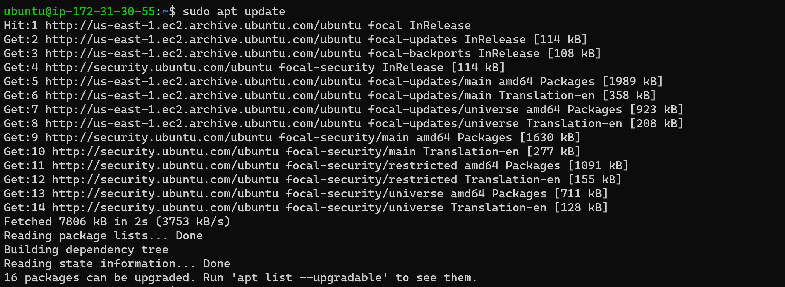

## Documentation of Project-1

Created an AWS Account, and provisioned an Ubuntu Server. A preferred region (closest to my location) was selected and a new EC2 instance of t2.micro family with Ubuntu Server 20.04 LTS was launched.

Connected to my first EC2 instance by running "ssh -i <private-key-name>.pem ubuntu@<Public-IP-address>". See below.

`ssh -i "PBL.pem" ubuntu@ec2-54-167-43-211.compute-1.amazonaws.com`

Picture shows successful creation of a Linux server in the cloud

Next, Apache was installation and firewall update. Using Ubuntu packet manager 'apt' Apache was installed using the command "sudo apt update"

`sudo apt update`

The output above suggested an upgrade was available, thus using the command "sudo apt upgrade" an upgrade was performed.

`sudo apt upgrade`

`sudo apt install apache2`

Apache2 was verified as running as a Service in our OS, using the command "sudo systemctl status apache2"

`sudo systemctl status apache2`

TCP Port 80 (default port) was opened to recieve traffic on internet access on web browser.

Using the ‘curl’ command Apache HTTP Server on port 80 was requested.

`curl http://localhost:80`

Picture shows a small part of a long output

Opening a web browser, ip address 54.167.43.211 was typed in and the page below was displayed showing web page works.

**INSTALLING MYSQL**

Since a web server is confirmed running, a Data Base Management System needs be installed. 'Apt' is used to acquire and install this...

`sudo apt install mysql-server`

The above command prompts for confirmation and installs mysql-server. To log into mysql console, the commands below was used.

`sudo mysql`

Next Command

`sudo mysql_secure_installation`

When done, test was conducted to see if login MYSQL console was successful

`sudo mysql -p`

Exit by using the command

`mysql> exit`

MySQL server is now installed and secured

**INSTALLING PHP**

Apache was installed to serve my content and MySQL installed to store and manage my data. PHP is the component of the setup that will process code to display dynamic content to the end user. In addition to the php package, php-mysql will be needed, a PHP module that allows PHP to communicate with MySQL-based databases. libapache2-mod-php will be needed to enable Apache to handle PHP files. 

using the command below, these packages were installed

`sudo apt install php libapache2-mod-php php-mysql`

The command below was run to confirm that installation was complete

`php -v`

At this point, your LAMP stack is completely installed and fully operational.
L- Linux
A- Apache Server (HTTP)
M- My SQL
P- PHP

**CREATING A VIRTUAL HOST FOR YOUR MY WEBSITE USING APACHE**

A directory for projectlamp using ‘mkdir’ command

`sudo mkdir /var/www/projectlamp`

Ownership of the directory with my current system user was assigned with the commands

`sudo chown -R $USER:$USER /var/www/projectlamp`

A new configuration file in Apache’s sites-available directory using vi was created and opened.

`sudo vi /etc/apache2/sites-available/projectlamp.conf`

To see created file, the comand below was used

`sudo ls /etc/apache2/sites-available`

To enable virtual host, the command below was used

`sudo a2ensite projectlamp`

To check for errors use command

`sudo apache2ctl configtest`

Apache was reloaded for changes to take place with command

`sudo systemctl reload apache2`

New website is now active, but the web root /var/www/projectlamp is still empty. An index.html file in that location was created so that we can test that the virtual host works as expected using the command

`sudo echo 'Hello LAMP from hostname' $(curl -s http://169.254.169.254/latest/meta-data/public-hostname) 'with public IP' $(curl -s http://169.254.169.254/latest/meta-data/public-ipv4) > /var/www/projectlamp/index.html`

enabling PHP on the website the follwing commands was used

`sudo vim /etc/apache2/mods-enabled/dir.conf`

File was saved and closed and Apache reloaded for changes to take effect.

`sudo systemctl reload apache2`

A new file named index.php was created inside my custom web root folder

`vim /var/www/projectlamp/index.php`

This command above opens a blank file and the following valid php code was added

`<?php phpinfo();`

Web page showing my ip address was refreshed and got the following as shown below.

